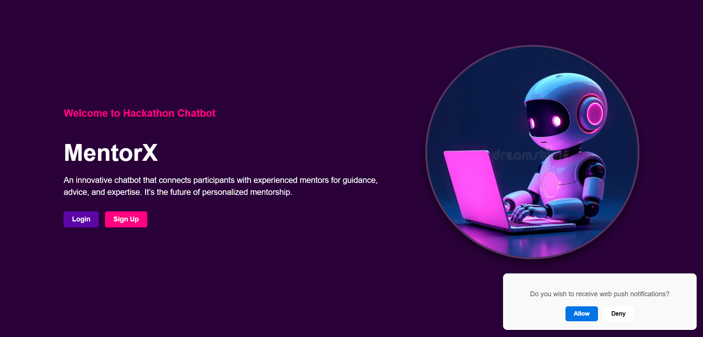

# MentorX



**MentorX** is an innovative chatbot designed to connect participants with experienced mentors in real-time. Whether you're looking for guidance on a project or seeking mentorship in a specific skill, MentorX helps you find the perfect match. The bot provides personalized mentorship suggestions based on skills, interests, and availability, ensuring you get the support you need to succeed.

## Features

- **Real-Time Mentor Matching**: Matches participants with mentors based on skills, goals, and availability.
- **Smart Notifications**: Keeps users updated with real-time event schedules, mentor availability, and other important details.
- **Easy Communication**: Facilitates seamless communication between mentors and participants via direct messaging.
- **User-Friendly Interface**: A simple, intuitive design that makes it easy for users to get started.
- **Skill-Based Pairing**: Matches mentors and participants based on technical and soft skills.
- **Event Updates**: Keeps track of hackathon or project deadlines and other relevant updates.

## Installation

To run MentorX locally, follow these steps:

### Prerequisites
- **Python 3.7+**
- **Flask** (for the backend server)
- **Dialogflow API** (or any other NLP engine you’re using)
- **SQLite/PostgreSQL/MySQL** (for storing user data)

### Clone the repository
```bash
git clone https://github.com/your-username/mentorx.git
cd mentorx
```

### Install dependencies
```bash
pip install -r requirements.txt
```

### Set up environment variables
Create a `.env` file and set up the following:
```
FLASK_APP=app.py
FLASK_ENV=development
DIALOGFLOW_PROJECT_ID=your-dialogflow-project-id
DATABASE_URI=your-database-uri
```

### Run the app
```bash
flask run
```

The app will be available at `http://localhost:5000`.

## Usage

1. **Signup**: Users can sign up as mentors or participants.
2. **Matchmaking**: Participants can fill out a profile with their skills, goals, and interests. Mentors can list their areas of expertise.
3. **Chatbot Interaction**: Users can interact with the chatbot to get mentor suggestions, project advice, and real-time event updates.
4. **Notifications**: Receive timely updates on upcoming events, deadlines, and mentor availability.

## API Integration

MentorX integrates with **Dialogflow** (or another NLP service) to process user inputs and provide relevant responses. If you're using Dialogflow, you will need to configure your credentials and intents to ensure smooth interactions.

## Contributing

1. Fork the repository
2. Create a new branch for your feature or fix
3. Make your changes and commit them
4. Push your changes to your fork
5. Open a pull request with a detailed description of your changes

## License

This project is licensed under the MIT License - see the [LICENSE](LICENSE) file for details.

## Acknowledgments

- **Dialogflow** for natural language processing.
- **Flask** for building the backend.
```
Happy Coding!!!
